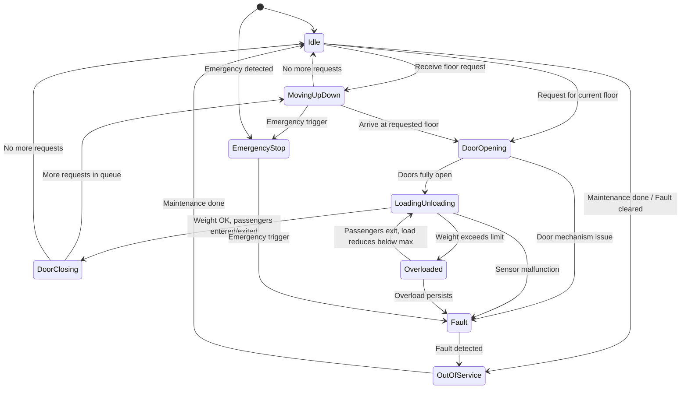
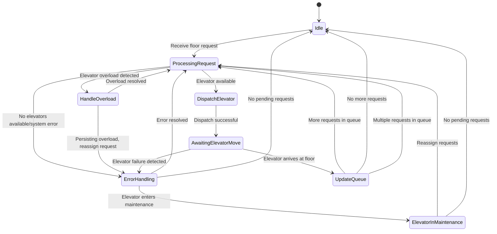

**Elevator State Diagram**

### **Explanation of Key States and Transitions**:

1. **Idle**: The elevator is stationary, waiting for a new request.
    - Transitions:
      - To **MovingUpDown**: A floor request is received.
      - To **DoorOpening**: The request is for the current floor.
      - To **OutOfService**: After maintenance or fault clearance.

2. **MovingUpDown**: The elevator is moving between floors to handle a request.
    - Transitions:
      - To **DoorOpening**: The elevator arrives at the requested floor.
      - To **Idle**: No more requests to handle after the current one.
      - To **EmergencyStop**: An emergency is detected during movement.

3. **DoorOpening**: The doors are opening to allow passengers to enter/exit.
    - Transitions:
      - To **LoadingUnloading**: The doors are fully opened.
      - To **Fault**: A door mechanism issue is detected.

4. **LoadingUnloading**: Passengers are entering/exiting the elevator, with the system monitoring the weight.
    - Transitions:
      - To **DoorClosing**: The load is below the maximum limit after passengers enter/exit.
      - To **Overloaded**: The weight exceeds the maximum capacity (e.g., 680 kg).
      - To **Fault**: A sensor or weight malfunction is detected.

5. **Overloaded**: The elevator is overloaded and cannot move until the load is reduced.
    - Transitions:
      - To **LoadingUnloading**: Passengers exit, and the load drops below the limit.
      - To **Fault**: The overload persists.

6. **DoorClosing**: The doors are closing after passengers enter/exit.
    - Transitions:
      - To **MovingUpDown**: There are more requests to handle.
      - To **Idle**: No more requests are pending.

7. **Fault**: A mechanical or sensor issue has been detected.
    - Transitions:
      - To **OutOfService**: The elevator is taken out of service for maintenance.
      
8. **OutOfService**: The elevator is out of service due to a fault or maintenance.
    - Transitions:
      - To **Idle**: The elevator is returned to service after maintenance.

9. **EmergencyStop**: The elevator is stopped due to an emergency situation.
    - Transitions:
      - To **Fault**: An emergency trigger (e.g., fire alarm) causes the elevator to stop.

---

**Central Controller State Diagram**

### **Detailed Breakdown of the Central Controller’s States and Transitions:**

#### **1. Idle**
   - **Description**: The Central Controller is in a waiting state, where no new requests have been received, and all elevators are either idle or handling existing requests.
   - **Transitions**:
     - **To Processing Request**: When a new floor request is received from either the External Request Panel or from inside an elevator.

#### **2. Processing Request**
   - **Description**: The Central Controller evaluates the request by checking the availability of all elevators and deciding which elevator is most suitable based on proximity, direction, load, and operational status.
   - **Transitions**:
     - **To Error Handling**: If no elevators are available or a system error occurs (e.g., all elevators are full or out of service).
     - **To Dispatch Elevator**: If one or more elevators are available, the system selects the best one and dispatches it to service the request.

#### **3. Dispatch Elevator**
   - **Description**: The Central Controller sends a command to the selected elevator, adding the floor request to the elevator’s queue. It also updates its own internal status to keep track of which elevator is handling the request.
   - **Transitions**:
     - **To Awaiting Elevator Move**: After dispatching, the system waits for the elevator to complete the request (move to the requested floor).

#### **4. Awaiting Elevator Move**
   - **Description**: The controller monitors the progress of the elevator after it has been dispatched. The system continuously receives position updates from the elevator.
   - **Transitions**:
     - **To Update Queue**: When the elevator reaches the requested floor, the system updates the elevator's queue (removes the request from its active queue).
     - **To Idle**: If the elevator reaches the requested floor and no further requests are pending in the system.
  
#### **5. Update Queue**
   - **Description**: The Central Controller updates its internal queue to remove the completed request from the elevator’s list of tasks. The system then checks if there are more pending requests.
   - **Transitions**:
     - **To Processing Request**: If there are more requests in the queue, the system returns to the request processing state to handle them.
     - **To Idle**: If no more requests are in the queue, the system transitions back to the Idle state.

#### **6. Error Handling**
   - **Description**: The Central Controller enters the error handling state when no elevators are available (e.g., all are busy, out of service, or overloaded) or if there’s a system fault.
   - **Transitions**:
     - **To Idle**: Once the error condition has been resolved or a fallback mechanism is triggered (e.g., another elevator becomes available).
     - **To Processing Request**: Once the system is ready to handle the pending request again, it returns to the request processing state.

---

### **Detailed State Transitions with Triggers and Events**:

1. **Idle** → **Processing Request**:
   - **Trigger**: A new floor request is received.
   
2. **Processing Request** → **Error Handling**:
   - **Trigger**: No elevators are available (e.g., all are full, out of service, or system error occurs).
   
3. **Processing Request** → **Dispatch Elevator**:
   - **Trigger**: One or more elevators are available, and the controller selects the most suitable one based on proximity, direction, and load.
   
4. **Dispatch Elevator** → **Awaiting Elevator Move**:
   - **Trigger**: The elevator is successfully dispatched and begins moving to the requested floor.

5. **Awaiting Elevator Move** → **Update Queue**:
   - **Trigger**: The elevator arrives at the requested floor, and the doors open.
   
6. **Update Queue** → **Processing Request**:
   - **Trigger**: More pending requests are in the system.
   
7. **Update Queue** → **Idle**:
   - **Trigger**: No more requests are pending in the system.
   
8. **Error Handling** → **Idle**:
   - **Trigger**: Error is resolved, and the system returns to normal operation.
   
9. **Error Handling** → **Processing Request**:
   - **Trigger**: The system is ready to handle the pending request again (e.g., a previously unavailable elevator becomes available).

---

